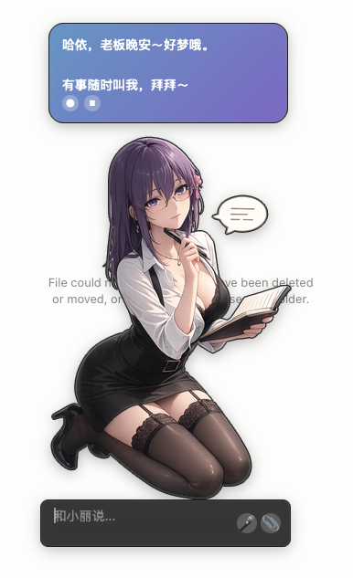

# 欢欢 Huanhuan

macOS 桌面 AI 宠物。常驻屏幕右侧，随时待命。



## 故事起源

欢欢是我家一只非常不听话的边境牧羊犬。

某天突发奇想：既然真狗不听话，不如给它造一个 AI 分身来替我打工。

于是打开编辑器，写下了第一版需求文档。那份文档里有一整段"**绝对不要做的事**"：

> 不要加麦克风录音  
> 不要加任何对话相关功能  
> 不要加 TTS / STT  
> 如果你觉得"应该"加点什么，停下来不加

现在这个项目有了语音输入、语音朗读、AI 对话、图片识别、多角色切换……

欢欢（真狗）依然不听话。

---

## 功能特性

- 🐾 **多角色切换** — 欢欢（边境牧羊犬）、瓦力（小机器人）、雪宝（小企鹅）、可自定义
- 🎞️ **帧动画** — 每个角色支持多帧流畅动画，静止时待机，对话时活跃
- 💬 **气泡对话** — 右上角半透明气泡，打字回复，自动消失
- 🎤 **语音输入** — 点击麦克风录音，自动识别转文字（Google STT）
- 🔊 **语音朗读** — 点击喇叭图标用 macOS 原生 TTS 朗读回复
- 📎 **图片识别** — 上传图片/截图，AI 理解图片内容后回答
- 🧠 **独立记忆** — 每个角色有独立的对话记忆和人格
- 🖱️ **随意拖动** — 窗口和气泡均可自由拖动定位
- ⚙️ **首次向导** — 引导配置 AI 供应商（MiniMax、OpenAI、Claude 等）

## 依赖

- macOS 12+
- [Hermes Agent](https://github.com/nousresearch/hermes) — AI 核心引擎
- 任意支持的 AI 供应商账号（MiniMax、OpenAI、Anthropic 等）

## 快速开始

### 1. 安装 Hermes

```bash
pip install hermes-agent
# 或查看 https://github.com/nousresearch/hermes 获取最新安装方式
```

### 2. 克隆项目

```bash
git clone https://github.com/your-username/huanhuan.git
cd huanhuan
```

### 3. 安装依赖

```bash
npm install
cd huan-ui && pip install -r requirements.txt && cd ..
```

### 4. 开发模式运行

```bash
npm run dev
```

首次运行会弹出设置向导，按提示配置 AI 供应商 API Key。

### 5. 构建发布版

```bash
npm run tauri build
```

## 角色配置

角色数据存放在 `huan-ui/user/characters/{id}/`：

| 文件 | 说明 |
|------|------|
| `config.json` | 角色元数据（名称、帧数、系统提示词） |
| `SOUL.md` | 角色人格描述（发给 AI 的系统提示） |
| `frames/` | 动画帧图片（`frame-0001.png` 为静态默认图） |

### 添加新角色

1. 在 `huan-ui/user/characters/` 新建文件夹（比如 `mychar/`）
2. 创建 `config.json`：
   ```json
   {
     "id": "mychar",
     "name": "我的角色",
     "description": "角色简介",
     "system_prompt": "你是...",
     "frames_count": 1
   }
   ```
3. 创建 `SOUL.md` 写入人格描述
4. 放入 `frames/frame-0001.png`（角色图片，建议透明背景 PNG）
5. 重启应用，右键菜单 → 切换人物

### 动画帧

默认每个角色只包含一张静态图（`frame-0001.png`）。动画帧包可从 Release 页面下载：

1. 下载对应角色的帧压缩包
2. 解压到 `~/Library/Application Support/huanhuan/user/characters/{id}/frames/`
3. 重启应用即自动使用动画

## 图片识别

需要 [OpenRouter](https://openrouter.io) API Key（免费注册，免费模型每天 50 次）：

1. 注册 OpenRouter，获取 API Key
2. 在 Hermes 配置中添加：
   ```yaml
   # ~/.hermes/config.yaml
   auxiliary:
     vision:
       provider: openrouter
       api_key: sk-or-v1-...
   ```
3. 或设置环境变量：`export OPENROUTER_API_KEY=sk-or-v1-...`

## 项目结构

```
huanhuan/
├── src/                    # 前端（Tauri WebView）
│   ├── index.html          # 主界面
│   ├── main.js             # 前端逻辑
│   └── setup.html          # 首次启动向导
├── src-tauri/              # Rust 后端（Tauri）
│   ├── src/lib.rs          # 主要命令（语音、窗口控制等）
│   └── scripts/            # 辅助脚本（STT 服务等）
├── huan-ui/                # Python HTTP 服务（端口 8868）
│   ├── api/
│   │   ├── streaming.py    # 流式对话 + 图片识别
│   │   ├── routes.py       # API 路由
│   │   └── llm_config.py   # LLM 配置读取
│   ├── server.py           # 服务入口
│   └── user/               # 用户数据（不含敏感信息）
│       └── characters/     # 角色定义
├── assets/                 # 应用图标等静态资源
└── package.json
```

## 技术栈

- **前端**：HTML/CSS/JS（Tauri WebView）
- **后端**：Tauri（Rust）+ Python HTTP 服务
- **AI**：Hermes Agent（支持 MiniMax、OpenAI、Anthropic、本地模型等）
- **TTS**：macOS 原生 `say` 命令
- **STT**：Google Speech Recognition API（通过 `SpeechRecognition` 库）
- **视觉**：OpenRouter 免费视觉模型

## 常见问题

**Q：应用启动后白屏？**  
A：检查 Hermes 是否已安装：`hermes --version`

**Q：语音识别不工作？**  
A：需要联网，使用 Google 免费 STT API；确认麦克风权限已授权

**Q：图片识别返回失败？**  
A：检查 OpenRouter API Key 是否配置；免费模型每天 50 次上限

**Q：动画不流畅？**  
A：默认只有静态图，下载对应角色的动画帧包后解压即可

## License

MIT License — 详见 [LICENSE](LICENSE)

## 致谢

- [Tauri](https://tauri.app) — 跨平台桌面应用框架
- [Hermes Agent](https://github.com/nousresearch/hermes) — AI 智能体引擎
- [hermes-webui](https://github.com/nesquena/hermes-webui) — huan-ui 基于此项目修改而来（MIT License）
- [OpenRouter](https://openrouter.io) — 多模型 AI API 网关
